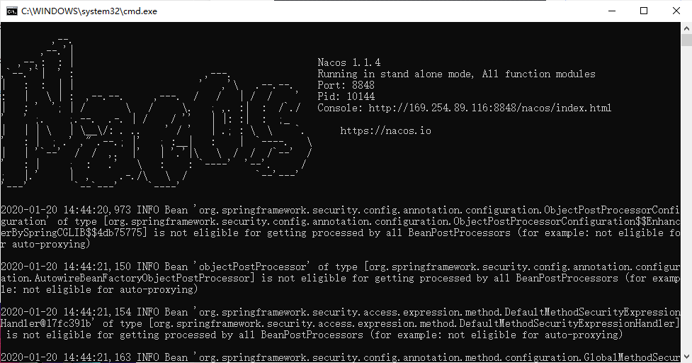
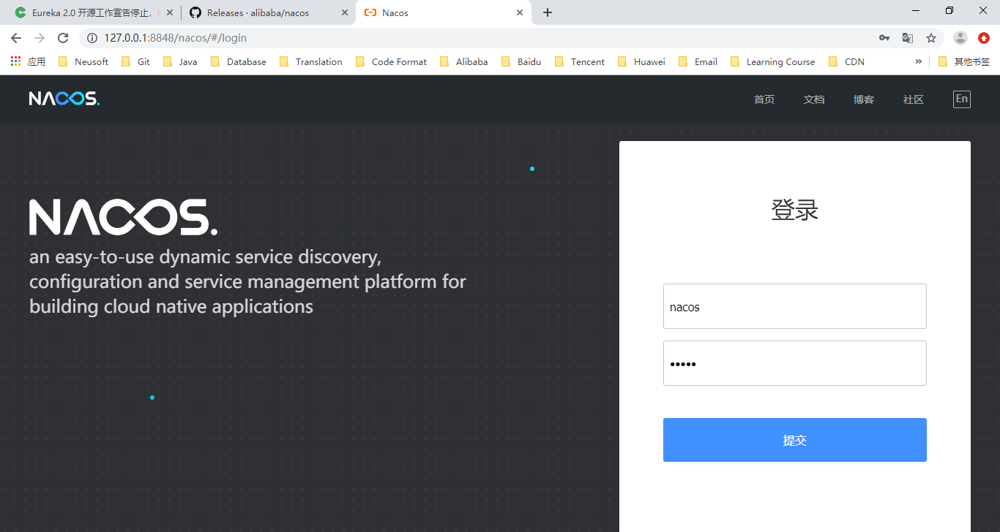
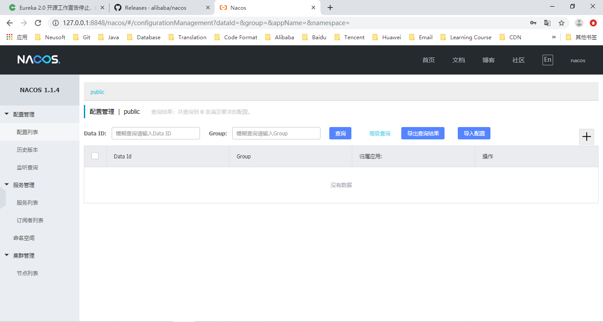

# Nacos 搭建

## 一 Windows 下环境搭建

### 1 下载

<https://github.com/alibaba/nacos/releases/download/1.1.4/nacos-server-1.1.4.zip>

版本：1.1.4

### 2 解压

### 3 启动

进入解压后的 bin 目录，执行 startup.cmd 

Nacos 默认端口为 8848，启动成功后可访问 <http://127.0.0.1:8848/nacos>，打开如下 Nacos 控制台登录界面。

默认用户名：nacos，默认密码：nacos

登录后界面如下：

## 二 相关资料

* Nacos 官网

  <https://nacos.io/zh-cn/index.html>

* Nacos 文档

  <https://nacos.io/zh-cn/docs/what-is-nacos.html>

* Nacos Config（分布式配置）

  <https://github.com/alibaba/spring-cloud-alibaba/wiki/Nacos-config>

* Nacos Discovery（服务发现）

  <https://github.com/alibaba/spring-cloud-alibaba/wiki/Nacos-discovery>

* 小马哥视频

  <https://www.bilibili.com/video/av32191103>

  <https://www.bilibili.com/video/av32723734>

## 三 为什么是 Nacos？而不是 Eureka？

众所周知，Spring Cloud 服务注册采用的是 Eureka，为什么我们非要使用 Nacos？其中最重要的原因是 Netflix 公司终止了 Eureka 2.0 的开源工作，Spring Cloud 目前采用的 Eureka 仍然是 1.X 版本。此外 Nacos 还可以作为分布式配置中心。因此，我们选择 Alibaba Nacos。 

* Eureka 2.0 闭源的讨论

  <https://www.oschina.net/news/97521/eureka-2-0-discontinued>

* Eureka 1.0 的问题和 Nacos 对比

  <https://www.sohu.com/a/240906237_355140>

* Nacos 功能和优势介绍

  <https://blog.csdn.net/yelvgou9995/article/details/84655163>

  <https://my.oschina.net/javaroad/blog/2996880>

  <http://www.sohu.com/a/243605227_355140>

  <https://www.sohu.com/a/246377339_494948>