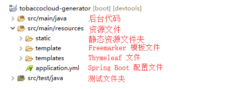
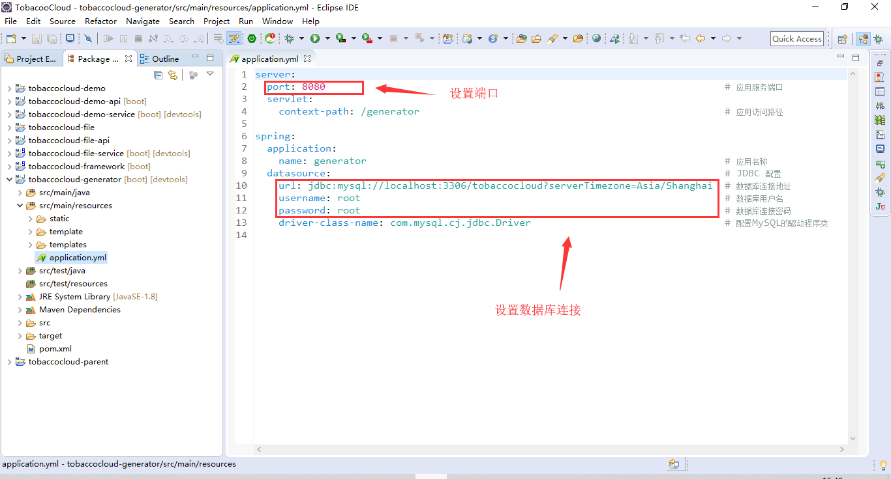
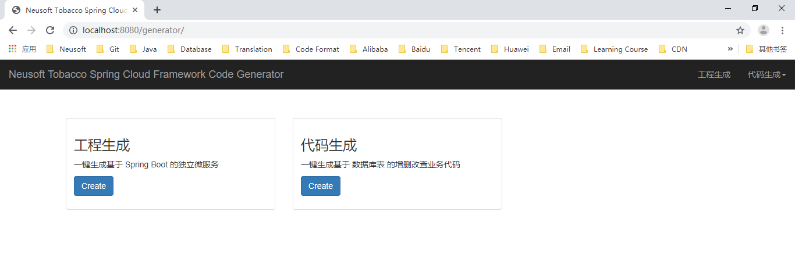
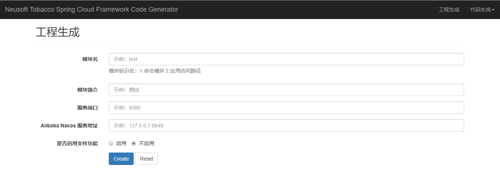
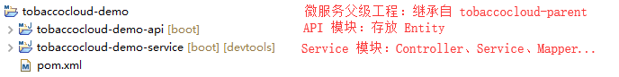
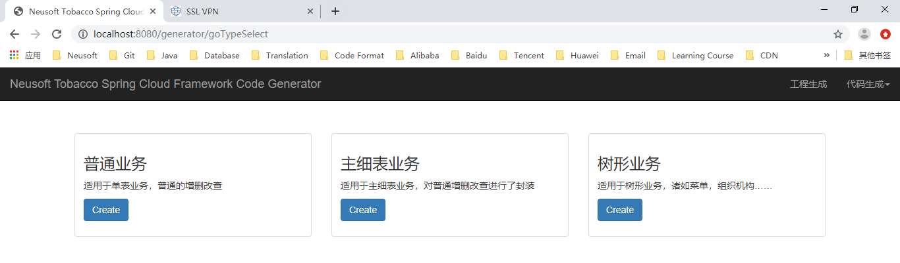
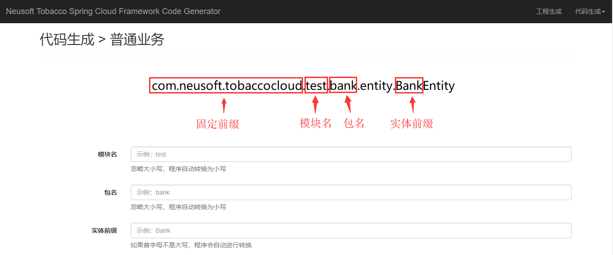
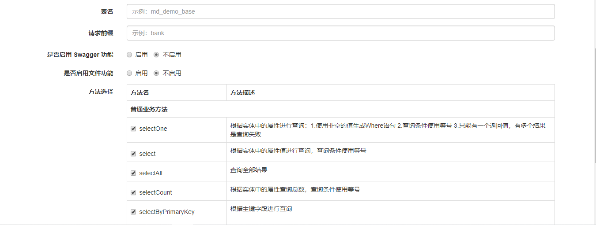

# 代码生成器

框架中 tobaccocloud-generator 工程即为代码生成器，该工程也是一个典型的 Spring Boot 工程，采用 Freemarker、Thymeleaf 等技术，同时提供可视化界面。目前仅支持 MySQL 数据库。

## 一 目录介绍

## 二 使用

### 1 设置数据库连接 & 端口

修改 src/main/resources/application.yml，配置数据库地址及端口（根据实际情况设置）

### 2 启动访问

启动该工程，在 Eclipse 中有如下两种方式

* 项目右击 → Run As → Spring Boot APP
* 启动类右击 → Run As → Spring Boot APP

访问 <http://localhost:8080/generator>

### 3 生成 Maven 工程

此功能用于生成一个新的独立的微服务功能，生成代码结构如下图

* 模块名

  对应结构图中的 `demo` 部分，同时将作为应用访问根路径

  应用访问根路径生成后可在 `Service` 模块 `application.yml` 中进行修改

* 模块简介

  用于在 `pom.xml` 生成 <description> 信息

* 服务端口

  此微服务服务端口

  生成后可在 `Service` 模块配置文件中进行修改

* `Alibaba Nacos` 服务地址

  `Nacos` 注册、配置中心地址

  生成后可在 `Service` 模块配置文件中进行修改

* 是否启用文件功能

  此微服务工程是否需要进行文件处理，勾选启用，会自动引入文件操作相关类

### 4 生成代码

此模块主要为基于数据库表生成业务代码，目前支持三种类型：

* 普通业务
* 主细表业务
* 树形业务

下面以普通业务代码生成为例，做详细说明：

* 模块名

  所属业务模块

* 包名

  Entity，Controller，Service 类上级包名

* 实体前缀

  生成实体前缀，同时将作为 Controller、Service、Mapper 等类的前缀

* 表名

  数据库表名

* 请求前缀

  Controller 层统一前缀

* 是否启用 Swagger 功能

  是否启动 Swagger，默认关闭。启用后，在生成的 Controller 类中会增加 @Api 注解，方便后台开发人员自测。

* 是否启用文件功能

  是否需要进行文件操作。如果启动还需要进行进一步的设置。使用此功能前建议了解本框架的文件功能。

* 方法选择

  选择 Controller 层需要使用的方法，默认全选。

## 三 相关链接

* Thymeleaf

  <https://www.thymeleaf.org/>

* Freemarker

  <https://freemarker.apache.org/>